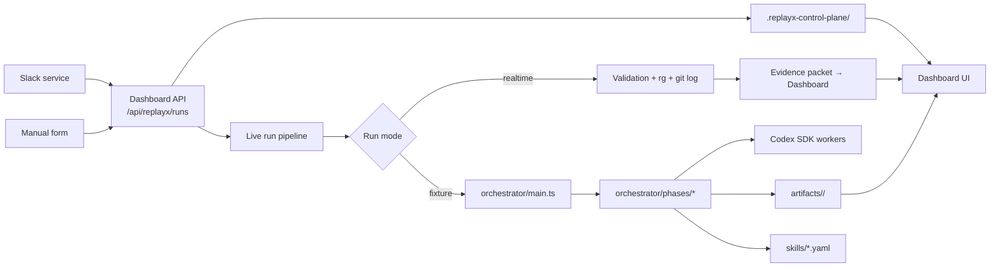
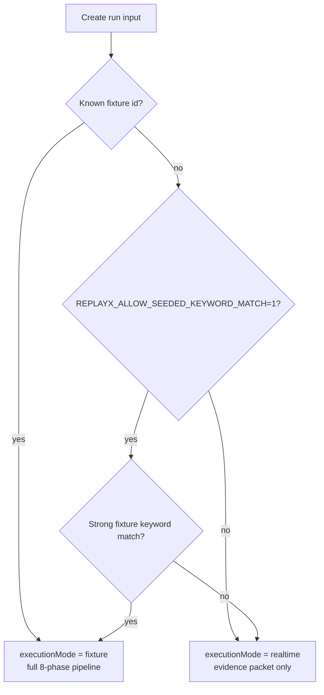

# Engineering

Implementation reference for ReplayX. Code is the source of truth — this document maps the code into an operator-readable architecture.

Phase model, flow diagram, and artifact map: [`../PIPELINE.md`](../PIPELINE.md)

---

## Runtime Architecture



---

## Components

| Component | Path | Responsibility |
|---|---|---|
| Orchestrator | `orchestrator/main.ts` | CLI runner — single phases and full golden/fixture runs |
| Type contracts | `orchestrator/types.ts` | Canonical TypeScript contracts for every phase input and output |
| Phase runners | `orchestrator/phases/*.ts` | One implementation file per phase |
| Prompt templates | `orchestrator/prompts/` | Runtime prompt templates for Codex-backed workers |
| Dashboard | `dashboard/` | Next.js UI, REST API, live-run control plane, analytics, signed actions |
| Slack intake | `slack/` | Express service — receives Slack mentions, posts to the dashboard API |
| Target app | `demo_app/` | Intentionally broken app — repro surface for bundled fixture/eval incidents |
| Incident registry | `incidents/` | Normalized JSON fixtures validated before any pipeline run |
| Skill catalog | `skills/` | YAML incident memory — read in Phase 2, written in Phase 8 |

---

## Codex Worker Model

Codex is used where repo-aware reasoning adds signal that deterministic heuristics cannot produce:

- optional repro worker summary (Phase 3)
- six diagnosis workers, each scoped to one failure domain (Phase 4)

All Codex workers are:

| Property | Behavior |
|---|---|
| Isolated | One Codex thread per worker, no shared state |
| Read-only | Workers inspect code, never mutate it |
| Time-bounded | Per-worker timeout prevents a hung worker from blocking the run |
| Schema-bound | Output must match the typed JSON contract or the worker is marked `blocked` |
| Fallback-safe | Deterministic local heuristics preserve the artifact shape when Codex is unavailable |

Everything outside Phase 3 and Phase 4 is deterministic TypeScript: intake validation, skill match scoring, challenger gates, fix strategy ranking, review/regression planning, and artifact compilation.

---

## Run Mode Decision



By default, all fresh text becomes a realtime investigation. Seeded keyword matching is disabled unless `REPLAYX_ALLOW_SEEDED_KEYWORD_MATCH=1`. This prevents unvalidated fixture routing for genuinely novel incidents.

---

## Data and Storage

| Location | Purpose | Git |
|---|---|---|
| `.replayx-control-plane/` | Live run state for the dashboard control plane | Ignored |
| `artifacts/<incident-id>/` | Phase JSON, logs, postmortems, replay bundles, generated skills | Ignored |
| `skills/*.yaml` | Checked-in fixture/eval incident skills and generated incident memory | Committed |
| `incidents/*.json` | Checked-in fixture/eval incident bundles | Committed |

---

## Key Commands

```bash
pnpm build                                          # TypeScript compile
pnpm test                                           # Orchestrator + control-plane tests
pnpm golden-run incidents/checkout-race-condition.json   # Full fixture/eval run
pnpm dev:all                                        # Target app + dashboard
pnpm dev:all:slack                                  # Target app + dashboard + Slack service
pnpm --dir dashboard build                          # Dashboard production build
npm --prefix slack test                             # Slack service tests
```

---

## Engineering Boundary

The fixture/eval pipeline runs end to end for all three bundled incident classes. Fresh realtime runs collect validation output, source-search results, and recent-change evidence, then stop before claiming a PR-ready fix.

The next major runtime feature is a bounded Codex patch worker: edit only the files justified by the diagnosis, rerun the repro command, store the diff, and mark a PR path as ready only after the proof passes.
