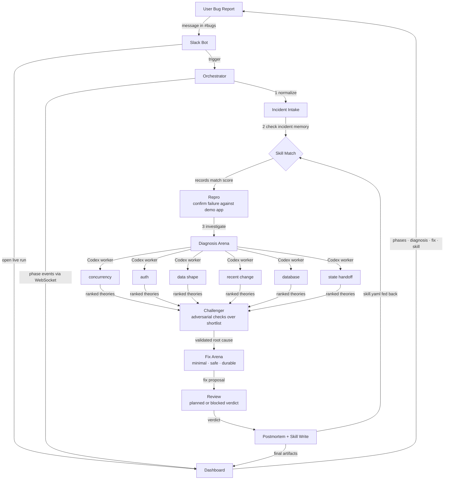

# ReplayX Pipeline

The canonical workflow reference for the ReplayX orchestrator.

ReplayX runs a deterministic 8-phase incident workflow. Every phase boundary produces auditable JSON artifacts, and every diagnosis and fix decision requires evidence before proceeding. The orchestrator coordinates bounded, Codex-powered specialists — it is not one unstructured agent loop.

ReplayX exposes this workflow in two modes:

- **Live run** — Slack or the run API triggers a fresh incident run. The dashboard streams real-time phase updates over WebSockets.
- **Replay** — Precomputed artifacts from a golden run power the stable `/replay/:incidentId` path. Use this as your demo safety net.

---

## System Flow



---

## Phases

| # | Phase ID | Label | What it does |
|---|---|---|---|
| 1 | `incident-intake` | **Incident Intake** | Normalizes the raw report into a strict incident bundle: title, symptom, logs, stack traces, metrics, repo context, and repro commands. |
| 2 | `skill-match` | **Skill Match** | Scores the incident against the `skills/` catalog. Records `fast_path_available` when a match exceeds the 0.85 threshold. Runs regardless — the score informs routing. |
| 3 | `repro` | **Repro** | Executes the incident's failing and healthy commands locally. Optionally sends the result to a Codex SDK worker for a concise failure-surface summary. |
| 4 | `diagnosis-arena` | **Diagnosis Arena** | Fans out to 6 parallel Codex workers, each specializing in a distinct failure domain. Falls back to deterministic heuristics when Codex is unavailable. |
| 5 | `challenger-validation` | **Challenger Validation** | Runs adversarial checks over the ranked shortlist. Rejects candidates that are weak, too broad, or below the 0.5 confidence floor. |
| 6 | `fix-arena` | **Fix Arena** | Generates three bounded fix strategies — `minimal_fix`, `safe_fix`, `durable_fix` — and ranks them by score. Selects the highest-scoring completed strategy as the winner. |
| 7 | `review-and-regression` | **Review & Regression** | Produces a review verdict (`planned` or `blocked`) and a regression verification plan. Does not auto-execute code. |
| 8 | `postmortem-and-skill` | **Postmortem & Skill Write** | Compiles the postmortem, writes `skill.yaml` back to `skills/` for future Skill Match runs, and emits the dashboard replay artifact, demo script, and Slack handoff blob. |

### Diagnosis Specialists

Phase 4 runs six workers in parallel, each owning one failure domain:

| Worker ID | Specialty |
|---|---|
| `diagnosis_concurrency` | Race conditions, stale snapshots, ordering failures |
| `diagnosis_auth` | Token expiry, session state, auth refresh paths |
| `diagnosis_data_shape` | Null guards, optional fields, schema mismatches |
| `diagnosis_recent_change` | Regression from the most recent merged commit |
| `diagnosis_database` | Transaction boundaries, snapshot versioning, commit correctness |
| `diagnosis_state_handoff` | Stale state crossing worker or cache boundaries |

---

## Core Rules

Every phase must follow these invariants:

- Prefer **bounded specialist workers** over one large unstructured run.
- Use **strict machine-readable outputs** between phases — no free-form blobs.
- Never accept a diagnosis without evidence.
- Never accept a fix without a verification plan.
- A single worker failure never terminates the run if the phase has remaining evidence.
- Every phase writes artifacts to disk so the run is fully inspectable and replayable.

---

## Artifacts Produced Per Run

Every golden run writes the following to `artifacts/<incident-id>/`:

```
artifacts/<incident-id>/
  normalized_incident.json              ← Phase 1  normalized bundle
  phase.incident-intake.json            ← Phase 1  metadata
  phase.skill-match.json                ← Phase 2  match score and decision
  phase.repro.json                      ← Phase 3  command results and failure surface
  verification.repro.log                ← Phase 3  stdout/stderr log
  diagnosis-workers/
    diagnosis_concurrency.json
    diagnosis_auth.json
    diagnosis_data_shape.json
    diagnosis_recent_change.json
    diagnosis_database.json
    diagnosis_state_handoff.json
  phase.diagnosis-arena.json            ← Phase 4  ranked worker results
  ranking.diagnosis-arena.log           ← Phase 4  ranking summary
  phase.challenger-validation.json      ← Phase 5  adversarial verdict
  challenger-validation.log             ← Phase 5  rejection log
  phase.fix-arena.json                  ← Phase 6  strategies and winner
  fix-arena.log                         ← Phase 6  scoring log
  phase.review-and-regression.json      ← Phase 7  review verdict and proof plan
  verification.review.log               ← Phase 7  review findings log
  postmortem.md                         ← Phase 8  human-readable postmortem
  skill.yaml                            ← Phase 8  reusable incident skill
  dashboard-replay.json                 ← Phase 8  dashboard artifact
  demo-script.json                      ← Phase 8  narrated demo beats
  slack-intake.json                     ← Phase 8  Slack handoff blob
  phase.postmortem-and-skill.json       ← Phase 8  metadata
```

---

## Running a Phase

```bash
# Run all 8 phases end to end — the primary command
pnpm golden-run incidents/checkout-race-condition.json

# Named pnpm shortcuts for individual phases
pnpm repro-phase       incidents/<incident>.json
pnpm challenger-phase  incidents/<incident>.json
pnpm fix-arena-phase   incidents/<incident>.json
pnpm review-phase      incidents/<incident>.json

# Run any phase directly
tsx orchestrator/main.ts --phase <phase-id> incidents/<incident>.json
```

> Running `--phase fix-arena` (or any later phase) re-runs all upstream phases from scratch. Only `--phase golden-run` writes the complete artifact set including intake, skill-match, and postmortem.

Available `--phase` values: `incident-intake` · `skill-match` · `repro` · `diagnosis-arena` · `challenger-validation` · `fix-arena` · `review-and-regression` · `postmortem-and-skill` · `golden-run`

---

## Implementation Status

All 8 phases are implemented and running end to end.

- Live runs stream phase-by-phase updates to the dashboard over WebSockets, with SSE as the fallback transport.
- Per-run state is tracked in a SQLite-backed control plane at `.replayx-control-plane/`.
- Skill Match scans `skills/` on every run. Phase 8 writes `skill.yaml` back to that directory, closing the feedback loop.
- Fix and review logic is seeded to the three bundled incident classes. Arbitrary-repository generalization is outside current scope.
