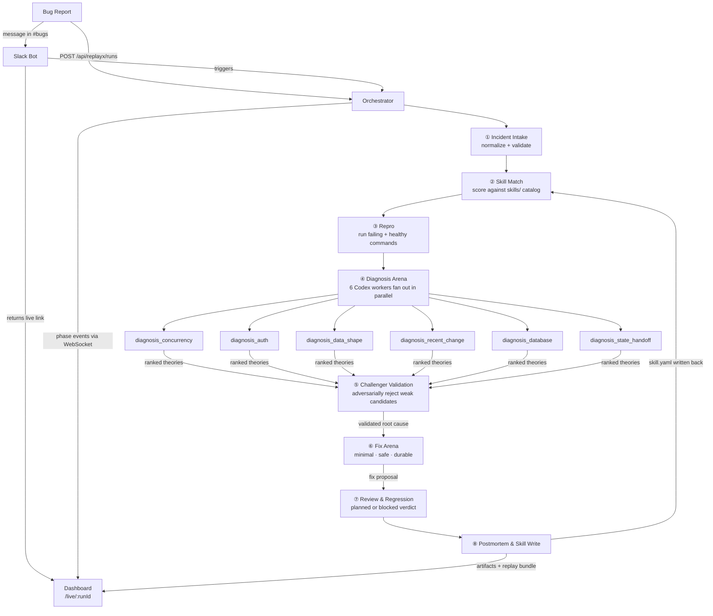

# ReplayX Pipeline

The canonical workflow reference for the ReplayX orchestrator.

ReplayX runs a **deterministic 8-phase incident workflow**. Every phase boundary is a strict JSON contract written to disk. No phase proceeds without evidence from the one before it. The orchestrator coordinates bounded, Codex-powered specialists — it is not one unstructured agent loop.

---

## System Flow



---

## Run Modes

| Mode | How triggered | What it shows |
|---|---|---|
| **Live run** | Slack mention or `POST /api/replayx/runs` | Real-time phase updates over WebSocket as the orchestrator advances |
| **Replay** | `pnpm golden-run` → `/replay/:incidentId` | Precomputed artifacts from a validated golden run — stable, durable, shareable |

---

## Phases

| # | Phase ID | Label | What it does |
|---|---|---|---|
| 1 | `incident-intake` | **Incident Intake** | Loads and strictly validates the raw incident JSON against the `NormalizedIncident` schema. Writes the normalized bundle to `artifacts/`. |
| 2 | `skill-match` | **Fast-Path Skill Match** | Scans `skills/` and `artifacts/` for matching skill YAML files. Scores by `incident_class` (weight 0.65), `service` (0.25), and `id` (0.10). Records `fast_path_available` when score ≥ 0.85. All phases still run — the flag informs future routing. |
| 3 | `repro` | **Repro** | Executes the incident's `failing` and `healthy` command specs. Runs an optional Codex SDK worker to summarize the failure surface. Writes `verified: confirmed`, `partially_confirmed`, or `blocked`. |
| 4 | `diagnosis-arena` | **Diagnosis Arena** | Fans out to 6 parallel Codex workers (concurrency capped at `REPLAYX_MAX_PARALLEL_WORKERS`, default 4). Each worker produces a structured diagnosis with confidence score, candidate files, observations, and a falsification note. Results are ranked into a shortlist. |
| 5 | `challenger-validation` | **Challenger Validation** | Runs adversarial checks over the ranked shortlist. Rejects candidates below the 0.5 confidence floor, without specific observations, or with insufficient class-support evidence. Produces a single validated winner. |
| 6 | `fix-arena` | **Fix Arena** | Generates three bounded fix strategies — `minimal_fix`, `safe_fix`, `durable_fix` — each with a blast radius, rollback note, verification command, and score. Selects the highest-scored completed strategy as the winner. |
| 7 | `review-and-regression` | **Review & Regression** | Produces a `planned` or `blocked` verdict and a regression verification proof plan. Does not auto-execute code. The verification command must confirm the failing path exits non-zero before the fix and zero after. |
| 8 | `postmortem-and-skill` | **Postmortem & Skill Write** | Compiles the human-readable postmortem. Writes `skill.yaml` to `skills/` — closing the feedback loop into Phase 2. Emits the dashboard replay bundle, operator brief, demo beats, and Slack handoff blob. |

---

## Diagnosis Specialists (Phase 4)

Six workers run in parallel, each owning exactly one failure domain:

| Worker ID | Specialty |
|---|---|
| `diagnosis_concurrency` | Race conditions, stale snapshots, ordering failures |
| `diagnosis_auth` | Token expiry, session state, auth refresh paths |
| `diagnosis_data_shape` | Null guards, optional fields, schema contract violations |
| `diagnosis_recent_change` | Regression from the most recent merged commit |
| `diagnosis_database` | Transaction boundaries, snapshot versioning, commit correctness |
| `diagnosis_state_handoff` | Stale state crossing worker or cache boundaries |

Each worker output is typed:

```typescript
interface ReplayXDiagnosisWorkerOutput {
  worker: ReplayXDiagnosisWorkerId;
  specialty: string;
  diagnosis: string;          // single-sentence root cause
  confidence: number;         // 0.0 – 1.0
  observations: string[];     // evidence citations
  commands_run: string[];     // commands the worker examined
  candidate_files: string[];  // files that likely contain the bug
  falsification_note: string; // what evidence would disprove this
  status: "completed" | "weak_signal" | "blocked";
}
```

Workers that cannot form a strong theory emit `weak_signal` and contribute to ranking but not to the winner selection.

---

## Fix Strategies (Phase 6)

| Strategy | Approach | Typical blast radius | Typical score |
|---|---|---|---|
| `minimal_fix` | Smallest targeted change | low | ~0.82 |
| `safe_fix` | Guard or normalization with highest verification confidence | low–medium | ~0.93 |
| `durable_fix` | Structural change for long-term correctness | medium | ~0.87 |

`safe_fix` typically wins. `durable_fix` beats `safe_fix` only when it is provably safer by score.

---

## Phase Invariants

Every phase must satisfy:

- Produce **machine-readable JSON artifacts** — no free-form blobs between phases.
- **Never accept a diagnosis without evidence.**
- **Never accept a fix without a verification plan.**
- A single worker failure must not terminate the run if the phase can continue with remaining evidence.
- Every artifact is written to `artifacts/<incident-id>/` so the run is fully inspectable and replayable.

---

## Artifacts Per Run

Every golden run writes the following to `artifacts/<incident-id>/`:

```
artifacts/<incident-id>/
  normalized_incident.json              ← Phase 1  validated incident bundle
  phase.incident-intake.json            ← Phase 1  intake metadata
  phase.skill-match.json                ← Phase 2  match score and routing decision
  phase.repro.json                      ← Phase 3  command results and failure surface
  verification.repro.log                ← Phase 3  stdout/stderr log
  diagnosis-workers/
    diagnosis_concurrency.json
    diagnosis_auth.json
    diagnosis_data_shape.json
    diagnosis_recent_change.json
    diagnosis_database.json
    diagnosis_state_handoff.json
  phase.diagnosis-arena.json            ← Phase 4  ranked worker results
  ranking.diagnosis-arena.log           ← Phase 4  ranking summary
  phase.challenger-validation.json      ← Phase 5  adversarial verdict
  challenger-validation.log             ← Phase 5  rejection log
  phase.fix-arena.json                  ← Phase 6  strategies and winner
  fix-arena.log                         ← Phase 6  scoring log
  phase.review-and-regression.json      ← Phase 7  review verdict and proof plan
  verification.review.log               ← Phase 7  review findings
  postmortem.md                         ← Phase 8  human-readable postmortem
  skill.yaml                            ← Phase 8  reusable incident skill
  dashboard-replay.json                 ← Phase 8  dashboard replay bundle
  demo-script.json                      ← Phase 8  narrated demo beats
  slack-intake.json                     ← Phase 8  Slack handoff blob
  phase.postmortem-and-skill.json       ← Phase 8  metadata
```

---

## Running Phases

```bash
# Run all 8 phases — the primary command
pnpm golden-run incidents/checkout-race-condition.json

# Named pnpm shortcuts
pnpm repro-phase       incidents/<incident>.json
pnpm challenger-phase  incidents/<incident>.json
pnpm fix-arena-phase   incidents/<incident>.json
pnpm review-phase      incidents/<incident>.json

# Run any single phase directly
tsx orchestrator/main.ts --phase <phase-id> incidents/<incident>.json
```

**Available `--phase` values:**
`incident-intake` · `skill-match` · `repro` · `diagnosis-arena` · `challenger-validation` · `fix-arena` · `review-and-regression` · `postmortem-and-skill` · `golden-run`

> Running `--phase fix-arena` (or any later phase) re-runs all upstream phases from scratch. Only `--phase golden-run` writes the complete artifact set including intake, skill-match, and postmortem.

---

## Implementation Status

All 8 phases are implemented and the golden path runs end to end.

| Phase | Status | Execution mode |
|---|---|---|
| 1 — Incident Intake | ✅ | Deterministic TypeScript validation |
| 2 — Skill Match | ✅ | Deterministic scoring against `skills/` and `artifacts/` |
| 3 — Repro | ✅ | Live command execution + optional Codex SDK worker |
| 4 — Diagnosis Arena | ✅ | Up to 6 Codex SDK workers with deterministic fallback |
| 5 — Challenger Validation | ✅ | Deterministic adversarial gates |
| 6 — Fix Arena | ✅ | Seeded strategy templates, deterministic ranking |
| 7 — Review & Regression | ✅ | Deterministic verdict and verification plan |
| 8 — Postmortem & Skill Write | ✅ | Deterministic artifact compilation |

Fix and review logic is seeded for the three bundled launch classes (`checkout-race-condition`, `auth-token-session-failure`, `null-data-shape-failure`). Incidents outside the registry enter an assisted execution path with explicit operator handoff. See [Docs/replayx-incident-authoring-guide.md](Docs/replayx-incident-authoring-guide.md) to extend the registry.
